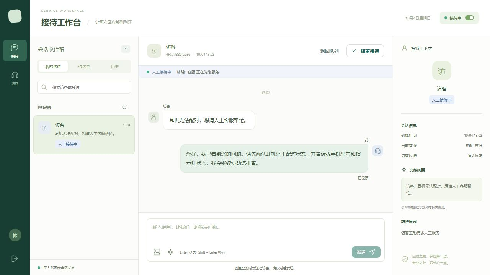
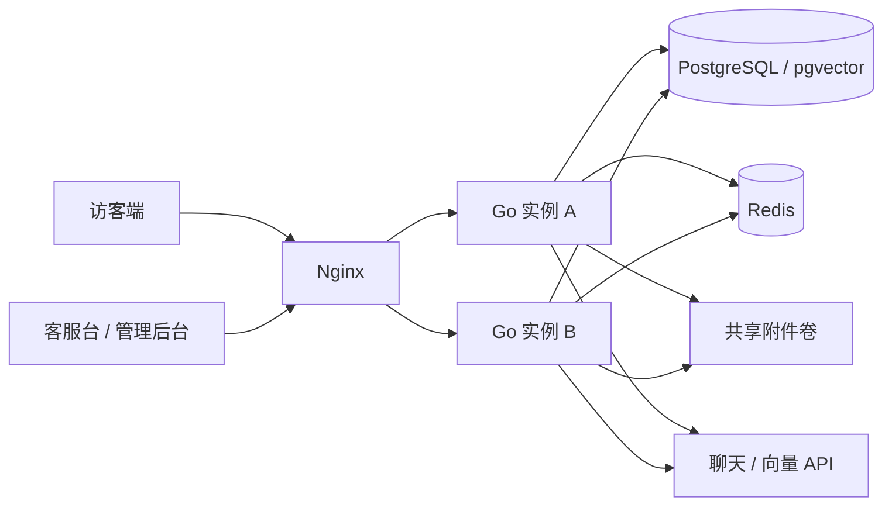

# Luma · AI 客服平台

Luma 是一个独立部署的智能客服系统。访客无需注册即可发起文字或图片咨询，AI 结合知识库回答；遇到无法确认的问题或访客主动请求时，转入人工接待队列，客服接单后继续处理完整对话。

后端采用 Go 模块化单体，前端采用 Vue 3 / TypeScript，使用 PostgreSQL / pgvector 存储业务数据和知识向量，Redis 提供跨实例通知与在线状态，Nginx 统一提供 HTTP 和 WebSocket 入口。



## 功能

| 模块 | 能力 |
| --- | --- |
| 访客咨询 | 浏览器身份恢复、文字与图片、历史记录、发送重试、未读提示、主动转人工和解决反馈 |
| AI 接待 | 多轮对话、知识检索、图片理解、来源引用、澄清与自动转人工 |
| 人工接待 | 公共队列、并发接单保护、多会话处理、快捷回复、退回队列、结束与归档 |
| 知识管理 | TXT / Markdown / 文字型 PDF、处理状态、失败重试、版本替换、启停、删除与检索预览 |
| 管理后台 | 客服账号、会话查询与改派、服务统计、模型调用记录 |

## 快速启动

需要 Docker Engine 和 Docker Compose v2。以下命令均在仓库根目录执行。

Linux / macOS（需要 OpenSSL）：

```sh
sh scripts/setup.sh
docker compose up --build -d
docker compose ps -a
```

Windows PowerShell 5.1 / 7：

```powershell
./scripts/setup.ps1
docker compose up --build -d
docker compose ps -a
```

初始化脚本生成随机密码并保留已有 `.env`。首次启动会执行数据库迁移和管理员初始化；`init` 容器退出码为 0 表示初始化成功。

- 访客入口：<http://localhost:8090>
- 客服及管理员登录：<http://localhost:8090/login>
- 管理员邮箱：`.env` 中的 `ADMIN_EMAIL`，初始密码：`ADMIN_PASSWORD`

默认只初始化管理员。登录管理后台创建客服账号，客服将接待状态切换为“接待中”，即可领取等待中的会话。需要预置示例客服时可显式设置 `SEED_DEMO=true`。重启或修改初始化环境变量不会重置已有账号密码。

## AI 配置

在 `.env` 配置聊天和向量服务：

```dotenv
CHAT_BASE_URL=https://dashscope.aliyuncs.com/compatible-mode/v1
CHAT_MODEL=qwen3-vl-plus
CHAT_API_KEY=
EMBEDDING_BASE_URL=https://dashscope.aliyuncs.com/compatible-mode/v1
EMBEDDING_MODEL=text-embedding-v4
EMBEDDING_API_KEY=
```

密钥、端点和模型必须匹配已开通的区域。聊天模型须支持图片输入及工具调用，向量固定为 1024 维。更换向量模型或端点后需要重新处理知识文档。

配置后执行 `docker compose up -d --force-recreate app1 app2`。管理员上传业务资料，待文档状态变为“可用”后，先使用检索预览检查召回片段，再验证实际问答。`examples/knowledge` 提供可选的虚构资料格式示例，不会自动导入。

未配置密钥时人工服务仍可使用，AI 不可用状态会明确展示。测试模型仅存在于自动化测试中，应用运行时不会以模拟回复替代模型调用。

## 架构与可靠性



- 消息提交事务后确认成功；客户端唯一编号用于去重，会话内序号用于排序和补拉。
- Redis 通知用于及时刷新，断线重连和周期对账从数据库恢复消息。
- AI 任务持久化并使用租约领取；回复提交时校验租约代次、会话版本和接待状态，阻止重复或迟到回复。
- 文档新版本处理成功后原子切换；停用与删除立即停止参与检索。
- 访客、客服、管理员权限及图片访问由服务端校验，模型密钥仅保存在服务端。

默认部署为同一主机上的两个 Go 实例，共享数据库、Redis 和附件卷。数据库、缓存及主机本身不具备冗余部署能力。

## 文档

- [部署与运维](docs/deployment.md)：配置、HTTPS、备份、升级和故障处理
- [架构设计](docs/architecture.md)：事务、状态机、任务租约与检索链路
- [接口说明](docs/api.md)：HTTP、WebSocket 与权限约定
- [开发与测试](docs/testing.md)：开发环境、集成测试和验证方式
- [验证记录](docs/validation.md)：已执行检查及验证范围
- [安全说明](SECURITY.md)：数据处理与漏洞报告

## 开发与验证

需要 Go 1.25+、Node.js 22.12+、PostgreSQL / pgvector 和 Redis。

```sh
npm --prefix frontend ci
npm --prefix frontend run build
go test ./...
go vet ./...
go run ./cmd/server
```

默认测试不要求云端密钥。数据库、Redis 及进程恢复测试需要设置对应环境变量，详见[测试文档](docs/testing.md)。GitHub Actions 配置包含代码检查、集成测试、前端构建和容器启动检查；结果以实际工作流执行为准。

## 支持范围

知识文档最大 10 MB，PDF 最多 50 页，不支持扫描 PDF OCR。聊天图片支持 JPEG、PNG、WebP，最大 5 MB、2000 万像素；单次模型输入最多使用最近 3 张图片。

当前不包含订单查询、自动退款、多租户、群聊、音视频及跨主机附件存储。生产部署需配置 HTTPS、实际 `APP_ORIGINS`、`COOKIE_SECURE=true` 和备份监控；真实模型质量与部署环境需单独验收。
